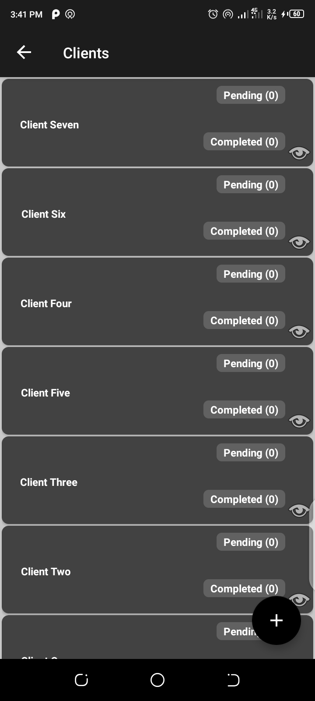
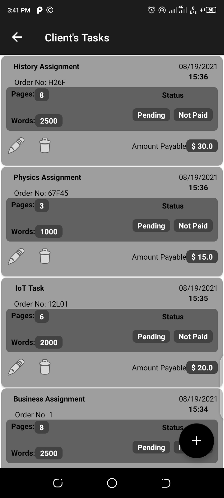
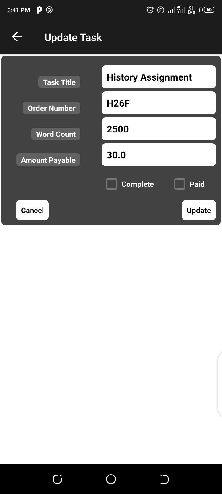

# Writer's Diary
> An Android Application build for online writers to keep track of their orders. It can be thought of as a diary for recording
orders. It would serve writers across all categories: article writers, blog writers, technical writers, academic writers and any
other user who would find the app useful. You can use the app as a <b>writer</b> or as a <b>client</b> or even <b>both</b>

## Tech Stack
* ✨ [`MVVM architecture`][1] - Helps to write clean, structured, organized and easily testable code
    * [`Room Database`][2] - For data storage and persistence
    * [`ViewModel`][3] - Stores and manages UI-related data in a lifecycle conscious way. It also allows data to survive configuration changes such as screen rotations.
    * [`Repository`][4] -  Handle data operations. provides a clean API so that the rest of the app can retrieve this data easily
    * [`LiveData`][15] & [`Flow`][15] - these patterns facilitate live updates in the app
* ✨ [`Dagger Hilt`][5] - A dependency injection library for Android that reduces the boilerplate of doing manual dependency injection in your project
* ✨ [`CardView Layout`][6] - Gives views a card-like interface
* ✨ [`RecyclerViews`][7] - for efficient display of large lists of data
    * [`ListAdapter`][8]
    * [`DiffUtil`][9] -  calculates the difference between two lists to efficiently update a list displayed by RecyclerView.
* ✨ [`Coroutines`][10] - Helps to manage long-running tasks that might otherwise block the main thread and cause your app to become unresponsive
* ✨ [`Fragments`][11] - Provides reusable portions of the App's UI
* ✨ [`DataBinding`][12] -  allows you to bind UI components in your layouts to data sources in your app using a declarative format rather than programmatically.
* ✨ [`BindingAdapters`][13] - Responsible for making the appropriate framework calls to set values t o views ...
* ✨ [`Navigation Component`][14] - Helps to implement navigation, from simple button clicks to more complex patterns, such as app bars and the navigation drawer
    *Safeargs - passing data between fragments

### Screenshots
|||||
|:--:|:--:|:--:|:--:|
||||
|:--:|:--:|:--:|

[1]:https://www.geeksforgeeks.org/mvvm-model-view-viewmodel-architecture-pattern-in-android/
[2]:https://developer.android.com/training/data-storage/room/
[3]:https://developer.android.com/topic/libraries/architecture/viewmodel
[4]:https://medium.com/swlh/repository-pattern-in-android-c31d0268118c
[5]:https://developer.android.com/training/dependency-injection/hilt-android
[6]:https://developer.android.com/guide/topics/ui/layout/cardview
[7]:https://developer.android.com/guide/topics/ui/layout/recyclerview
[8]:https://developer.android.com/guide/topics/ui/layout/recyclerview
[9]:https://developer.android.com/codelabs/kotlin-android-training-diffutil-databinding#0
[10]:https://developer.android.com/kotlin/coroutines
[11]:https://developer.android.com/guide/fragments
[12]:https://developer.android.com/topic/libraries/data-binding/
[13]:https://developer.android.com/topic/libraries/data-binding/binding-adapters
[14]:https://developer.android.com/guide/navigation
[15]:https://proandroiddev.com/flow-livedata-what-are-they-best-use-case-lets-build-a-login-system-39315510666d


## [](https://opensource.org/licenses/Apache-2.0)
```
   Copyright 2021 Samuel Juma

   Licensed under the Apache License, Version 2.0 (the "License");
   you may not use this file except in compliance with the License.
   You may obtain a copy of the License at

       http://www.apache.org/licenses/LICENSE-2.0

   Unless required by applicable law or agreed to in writing, software
   distributed under the License is distributed on an "AS IS" BASIS,
   WITHOUT WARRANTIES OR CONDITIONS OF ANY KIND, either express or implied.
   See the License for the specific language governing permissions and
   limitations under the License.
   ```
